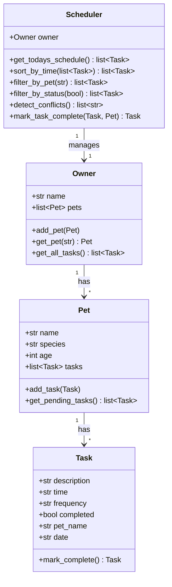

```mermaid
classDiagram
    class Task {
        +str description
        +str time
        +str frequency
        +bool completed
        +str pet_name
        +str date
        +mark_complete() Task
    }

    class Pet {
        +str name
        +str species
        +int age
        +list~Task~ tasks
        +add_task(Task)
        +get_pending_tasks() list~Task~
    }

    class Owner {
        +str name
        +list~Pet~ pets
        +add_pet(Pet)
        +get_pet(str) Pet
        +get_all_tasks() list~Task~
    }

    class Scheduler {
        +Owner owner
        +get_todays_schedule() list~Task~
        +sort_by_time(list~Task~) list~Task~
        +filter_by_pet(str) list~Task~
        +filter_by_status(bool) list~Task~
        +detect_conflicts() list~str~
        +mark_task_complete(Task, Pet) Task
    }

    Owner "1" --> "*" Pet : has
    Pet "1" --> "*" Task : has
    Scheduler "1" --> "1" Owner : manages
```
